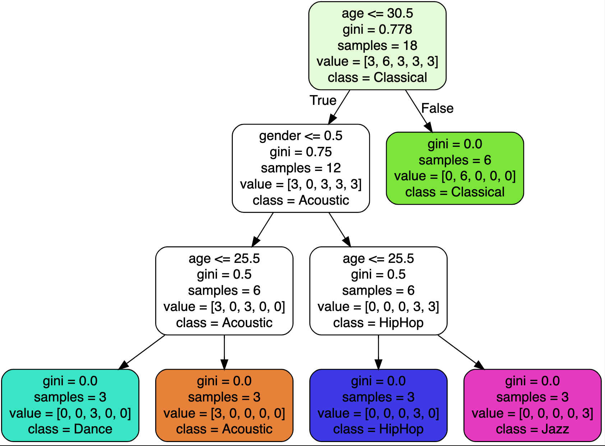

# Apollo
A machine learning project to predict the kind of music people like based on gender and age.

  <a href="https://travis-ci.org/achilles42/apollo"></img></a>
  <a href="http://hits.dwyl.com/achilles42/red"></img></a>

[Greek Apollo](https://en.wikipedia.org/wiki/Apollo) -  was the Olympian god of prophecy and oracles, music, song and poetry, archery, healing, plague and disease, and the protection of the young.

## Steps to follow for building music prediction ML project
1. Import the data
2. Clean the data
3. Split the data into training and testing sets
4. Create a model
5. Train the model 
6. Make prediction
7. Evaluate and improve
  
Libraries & Tools Used
1. Numpy
2. Pandas
3. Matplotlib
4. sklearn

## Dev Setup

Env
1. Jupyter
   1. Install [anaconda ](https://www.anaconda.com/products/distribution)

2. VS Code
3. Install Dot extention in VS code
4. Dataset - The CSV file used in this tutorial: https://bit.ly/3muqqta

### Visualization of Decision Tree

## Contribution
1. Fork it
2. Create your feature branch (git checkout -b my-new-feature)
3. Commit your changes (git commit -am 'Add some feature')
4. Push to the branch (git push origin my-new-feature)
5. Create a new Pull Request

Bug reports and pull requests are welcome on GitHub at https://github.com/[USERNAME]/apollo
